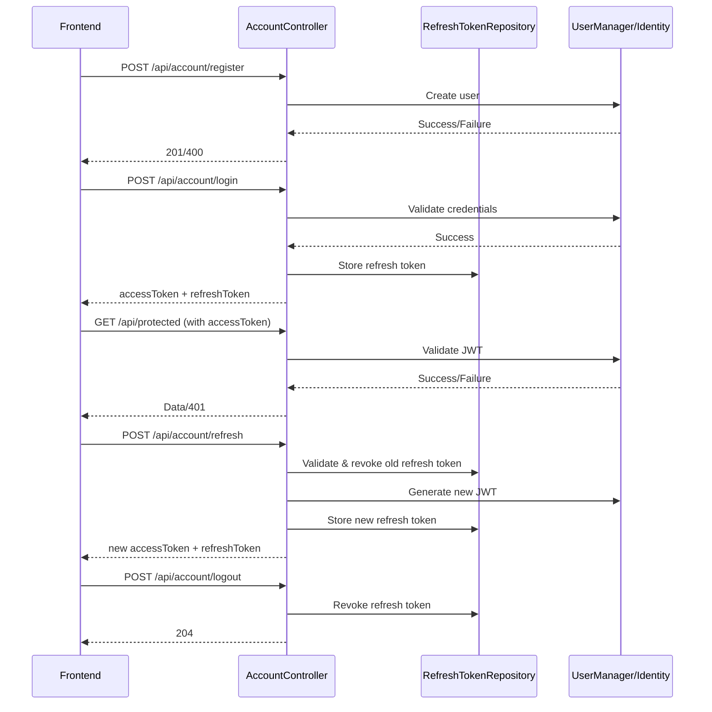

# MyProject Authentication & Authorization Guide

## Overview
MyProject uses ASP.NET Core Identity with JWT (JSON Web Token) authentication and refresh tokens. This setup is designed for modern SPAs (Single Page Applications) and works seamlessly with libraries like nuxt-auth.

---

## Authentication Flow

### 1. **User Registration**
- **Endpoint:** `POST /api/account/register`
- **Request Body:**
  ```json
  {
    "username": "string",
    "email": "string",
    "password": "string",
    "phoneNumber": "+420123456789",
    "firstName": "string",
    "lastName": "string",
    "emailConfirmed": false,
    "phoneNumberConfirmed": false,
    "twoFactorEnabled": false,
    "lockoutEnabled": false,
    "lockoutEnd": null
  }
  ```
- **Behavior:**
  - Registers a new user with the provided details.
  - Always assigns the `User` role (cannot register as Admin).
  - Returns `201 Created` on success.

---

### 2. **Login**
- **Endpoint:** `POST /api/account/login`
- **Request Body:**
  ```json
  {
    "username": "string",
    "password": "string"
  }
  ```
- **Response:**
  ```json
  {
    "accessToken": "<JWT access token>",
    "refreshToken": "<refresh token>"
  }
  ```
- **Behavior:**
  - Validates credentials.
  - Returns a short-lived JWT and a long-lived refresh token.

---

### 3. **Authenticated Requests**
- **How:**
  - Send the `accessToken` in the `Authorization` header:
    ```
    Authorization: Bearer <accessToken>
    ```
  - Use this for all protected API endpoints.

---

### 4. **Refreshing Tokens**
- **Endpoint:** `POST /api/account/refresh`
- **Request Body:**
  ```json
  {
    "refreshToken": "<refresh token>"
  }
  ```
- **Response:**
  ```json
  {
    "accessToken": "<new JWT>",
    "refreshToken": "<new refresh token>"
  }
  ```
- **Behavior:**
  - Validates and revokes the old refresh token.
  - Issues a new JWT and refresh token.
  - Returns 400 if the refresh token is invalid or expired.

---

### 5. **Logout**
- **Endpoint:** `POST /api/account/logout`
- **Request Body:**
  ```json
  {
    "refreshToken": "<refresh token>"
  }
  ```
- **Behavior:**
  - Revokes the refresh token in the database.
  - Client should delete both tokens from storage.

---

## Security Details
- **JWTs** are short-lived (configurable, e.g., 60 minutes).
- **Refresh tokens** are long-lived (configurable, e.g., 7 days), stored in the database and can be revoked.
- **Roles:** Only the backend can assign the `Admin` role. Registration always assigns the `User` role.
- **TimeProvider** is used for all time-based logic (token expiry, revocation) for testability.
- **Repository Pattern** is used for refresh token management (no direct DbContext usage in controllers).

---

## Sequence Diagram



---

## Frontend Integration Tips
- Store the `accessToken` in memory or secure storage (not localStorage if possible).
- Store the `refreshToken` in an HttpOnly cookie if possible, or secure storage.
- Use the `accessToken` for all API requests.
- Use the `refreshToken` only for refreshing the session.
- On logout, clear both tokens and call the logout endpoint.

---

## Optional Improvements
- Add endpoints for password reset, email confirmation, or user profile management as needed.
- Implement periodic cleanup of expired refresh tokens if you expect many tokens.
- Consider limiting the number of active refresh tokens per user/device for extra security.

---

## Contact
For questions or issues, contact the backend team.

